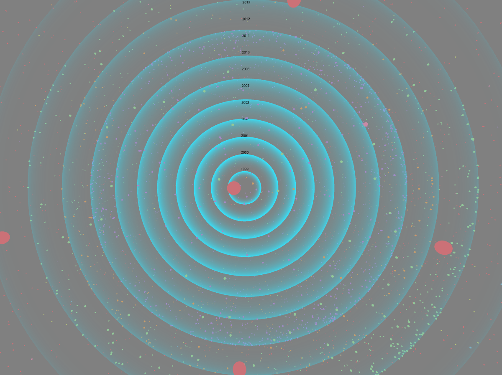
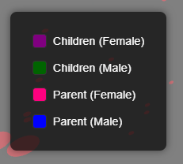
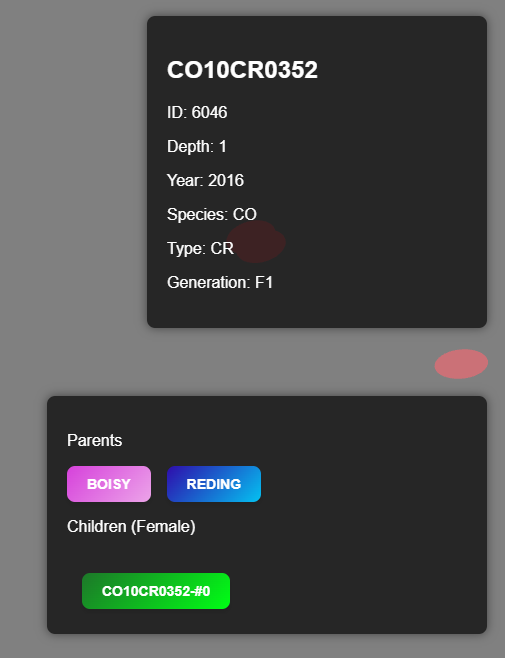
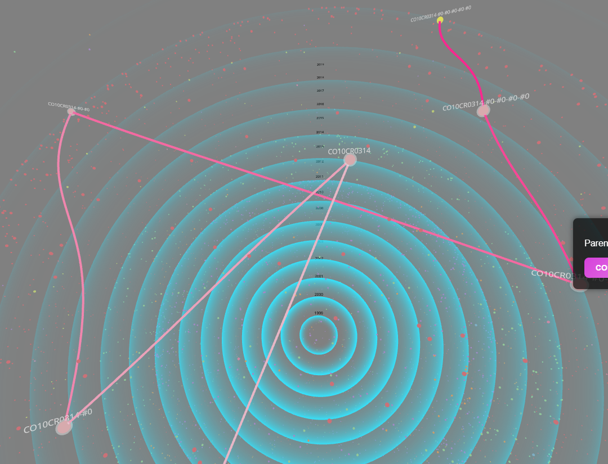
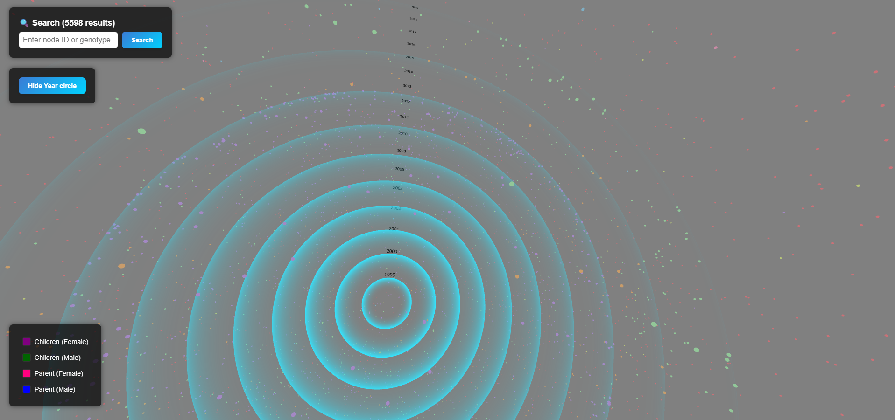
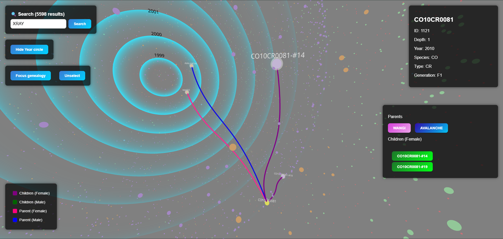
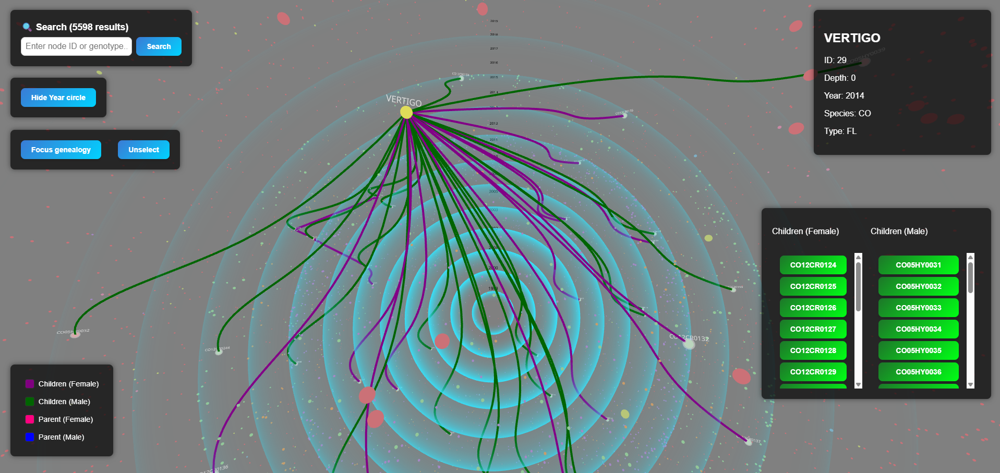
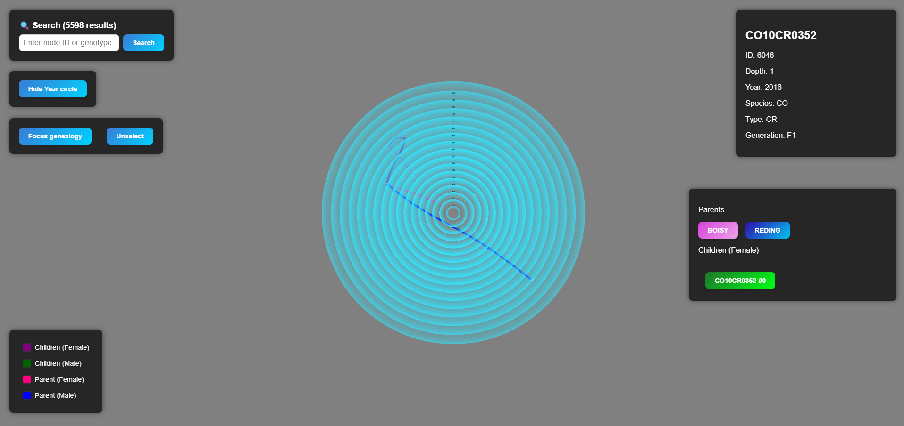
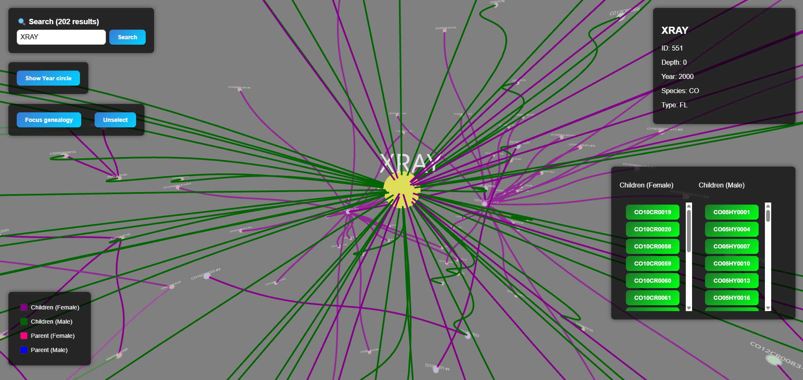
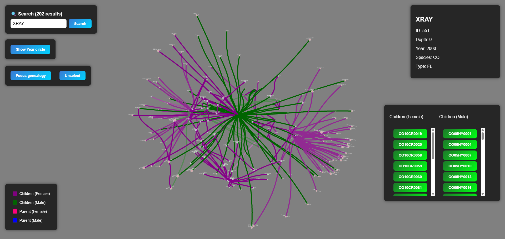

# 3D Genotype Genealogy Tree

This project visualizes the genealogy of genotypes in a 3D space using react-three (three.js).   

This project has been developed during a 2 day corporate hackathon at the company Doriane SAS. This is not an official project of the company, and the project is a prototype, it's not intended for production use. 

This project has been developed by me and a colleague Victor C.

It allows users to explore the relationships between different genotypes, their parents and children in an interactive 3D environment.

The dataset (~6000 genotypes) used in this project is a sample dataset of genotypes, which can be replaced with any other dataset in the same format. It comes from example dataset of the company Doriane SAS.   
*NOTE: The dataset is complex so the relation in the genealogy tree is not always clear.*

## How to run the project
To install the project, you need to have Node.js and Yarn installed on your machine.  
 *Node version used v22.17.0*

To install the dependencies, run the following command: `yarn`

To run the project, use the following command: `yarn dev` (http://localhost:5173/)

To run the project in production mode, use the following command: `npm run build` then `npx serve -s .\dist\` (http://localhost:3000/)

## How to use the project

### Informations
* Year of genotype creation is represented by the sphere with the blue color and the year is displayed on the top of the sphere.

* Legend of the relationships:
  	* Purple: All female children of the selected genotype
  	* Green: All male children of the selected genotype
	* Pink: All female male parents of the selected genotype
	* Blue: All male parents of the selected genotype

 

* You can see informations about the selected genotype in the top right corner of the screen. (name, ID, depth in genealogy, year of creation, species short name, cross type shortname and the generation)

* You can it's male parent in blue and female parent in pink. The children are displayed in green (female or male in dedicated column). All are buttons and you can click on them to select the genotype and focus on it.

* More the generation is far from the selected genotype, more the color of the sphere is light. In parent or child relationship.

* Each year layer node have a different color to distinguish them. 

### Interactions
* Use the mouse drag to move in the 3D space.
* Scroll the mouse wheel to zoom in and out.
* Use the mouse drag + CTRL (of SHIFT) key to rotate the camera.
* To select a genotype, click on its node in the 3D space.
* To focus on a genotype the selected node, press **"7"** (*pretty useful to reset zoom*).
* To focus on the global view, press **"8"**
* To focus on the global genealogy view, press **"9"**
* You can use the search on the top left corner to search for a genotype by its name.  
 

## Screenshots

 

 
 